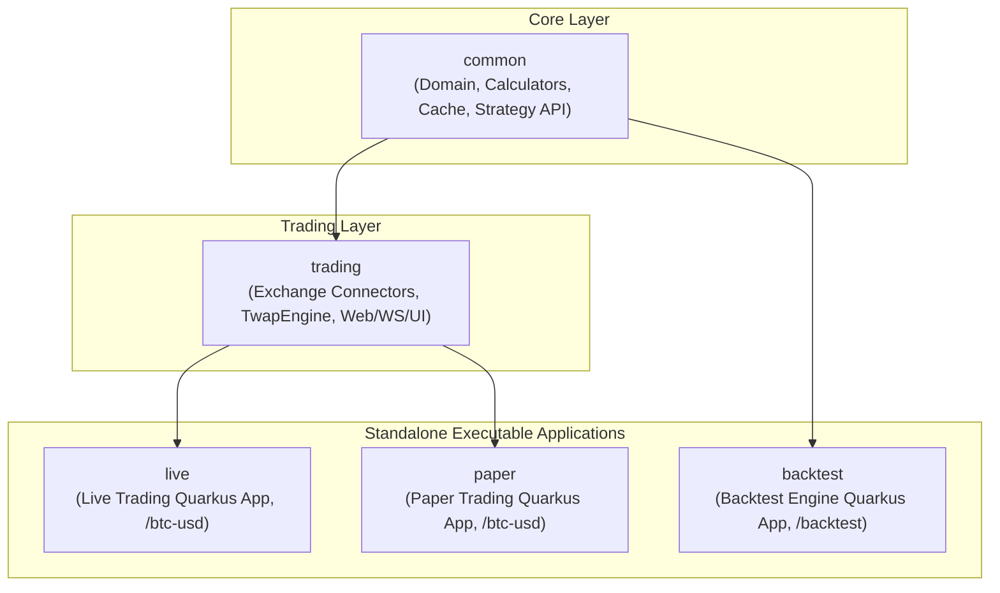

# Architecture Guide for AI Agents & Developers

This document defines the architectural boundaries, module hierarchy, and design rules for the **Polymarket Bot** project. All AI agents and developers **MUST** strictly adhere to these rules when modifying or adding code.

---

## 1. Module Hierarchy & Dependencies

The project is structured as a Maven Multi-Module project with 5 distinct submodules:

### Dependency Matrix & Isolation Rules

| Module | Packaging | Depends On | Allowed Dependencies | Prohibited Dependencies |
| :--- | :--- | :--- | :--- | :--- |
| **`common`** | `jar` (library) | *None* | Pure domain, math, Java standard library, minimal test tools | `trading`, `live`, `paper`, `backtest`, heavy frameworks |
| **`trading`** | `jar` (library) | `common` | `common`, Quarkus platform extensions (REST, Qute, WebSockets, Vert.x) | `backtest`, `live`, `paper` |
| **`live`** | `jar` (app) | `trading` | `trading` (transitive: `common`) | `backtest`, `paper` |
| **`paper`** | `jar` (app) | `trading` | `trading` (transitive: `common`) | `backtest`, `live` |
| **`backtest`**| `jar` (app) | `common` | `common`, historical data parsers, testing engines | `trading`, `live`, `paper` |

---

## 2. Invariant Rules (NON-NEGOTIABLE)

### Rule 1: Zero Backtest Leakage into Production
The production live trading system (`live`) and paper trading system (`paper`) **MUST NEVER** include backtesting dependencies, historical simulation scripts, or offline data ingestion tools. 
- `live` and `paper` run with minimal dependencies to ensure maximum stability, security, and low latency.
- Historical data loaders (Parquet, DuckDB, bulk CSV replays) belong exclusively in `backtest`.

### Rule 2: Zero Discrepancy between Backtest, Paper, and Live
Strategies, indicators, mathematical formulas, and order execution interfaces are defined once in `common`:
- A strategy implements `TradingStrategy` from `common`.
- The strategy interacts with the market solely via `StrategyContext` and `ExecutionRouter` from `common`.
- **Backtest**: `ExecutionRouter` is implemented as an in-memory simulated matching engine.
- **Paper Trading**: `ExecutionRouter` is implemented as a virtual simulator running against live Polymarket order books.
- **Live Trading**: `ExecutionRouter` is implemented as a signed EIP-712 order gateway executing on the real Polymarket CLOB.
- **Result**: The strategy bytecode is 100% identical in backtest, paper, and live.

### Rule 3: Jandex Indexing for Shared Quarkus Libraries
Because `common` and `trading` are library modules consumed by the runnable Quarkus applications (`live`, `paper`, `backtest`), all beans and endpoints in `trading` and `common` must be indexed via the `jandex-maven-plugin` and include `META-INF/beans.xml`.

---

## 3. Submodule Responsibilities

### `common`
- **Domain Models**: Immutable records and compact structures (`Timeframe`, `PriceSnapshot`, `TwapPoint`, `TwapUpdate`, `CandleTwapState`, `Exchange`).
- **Calculators & Math**: `MedianCalculator`, `TwapCalculator` (exact financial math).
- **In-Memory Cache**: `HourlyPriceCache` (sliding 3600-second window).
- **Strategy & Execution Contracts**: `TradingStrategy`, `StrategyContext`, `ExecutionRouter`, `Position`, `OrderCommand`.

### `trading`
- **Exchange Connectors**: `BinanceWebSocketClient`, `CoinbaseWebSocketClient`, `KrakenWebSocketClient`, `ExchangePayloadParser`, `ExchangePriceTracker`, `HistoricalDataReconstructor`.
- **Engines**: `TwapEngine` (1-second tick loop, candle rollover lifecycle, Binance timestamp synchronization).
- **Web & Streaming**: `BtcUsdResource`, `TwapWebSocketEndpoint`, Qute templates (`btc-usd.html`), static CSS and JavaScript (`btc-usd.js`).
- **Configuration**: `AppConfig`, `ChartRangeConfig`.

### `live`
- Standalone runnable Quarkus application for live real-money execution.
- Configured with `quarkus.http.port=8080`, `polymarket.trading.mode=live`.
- Direct connectivity to Polymarket CLOB and wallet signing.

### `paper`
- Standalone runnable Quarkus application for real-time virtual trading.
- Configured with `quarkus.http.port=8082`, `polymarket.trading.mode=paper`.
- Streams real market data but routes orders to a paper execution simulator.

### `backtest`
- Standalone runnable Quarkus application for backtesting strategies against historical datasets.
- Configured with `quarkus.http.port=8083`, `polymarket.trading.mode=backtest`.
- Exposes `/backtest` REST/UI endpoints for starting simulations and reviewing performance metrics (Sharpe ratio, Max Drawdown, PnL curve).

---

## 4. Low-Latency Engineering Principles
For detailed performance guidelines on GCP Dublin deployment, memory layout, GC elimination, and networking, see [`VISION.md`](VISION.md).
