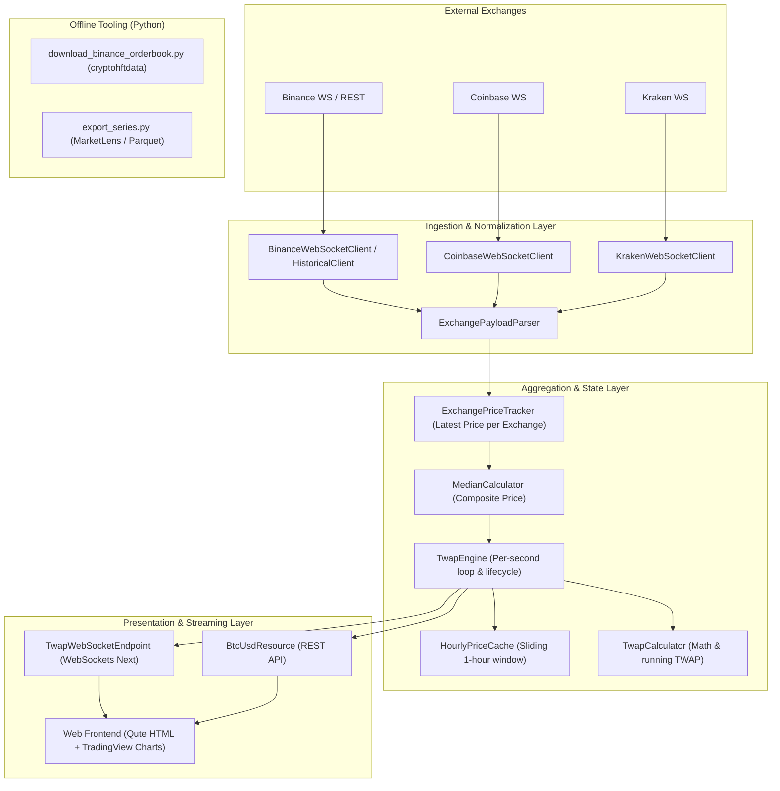

# Polymarket Crypto Bot

Real-time cryptocurrency price aggregation and TWAP (Time-Weighted Average Price) calculation engine designed for Polymarket prediction markets.

## Overview

Polymarket prediction markets (such as BTC/USD price binary options and timeframe resolution markets) settle based on price feeds across reference exchanges over specific time intervals. 

This application provides:
- **Multi-Exchange Streaming**: Live, low-latency WebSocket connections to Tier-1 exchanges: **Binance**, **Coinbase**, and **Kraken**.
- **Composite Median Pricing**: Real-time 1-second price snapshots calculating the median composite price across active exchanges to eliminate outliers and exchange-specific anomalies.
- **Dynamic TWAP Engine**: Continuous calculation and tracking of Time-Weighted Average Price (TWAP) for standard market timeframes (e.g. 5-minute and 15-minute candles), including opening price tracking, current progress, and per-second trajectory.
- **Historical Data Reconstruction**: Automatic historical backfill via REST API upon startup to reconstruct pre-existing candles and warm up the in-memory cache without gaps.
- **Real-Time Interactive Dashboard**: Built-in web console featuring TradingView Lightweight Charts (v5) with live WebSocket streaming, target badges, and sliding timeframe windows.
- **Data Engineering & Analysis Toolkit**: Python scripts for downloading Binance Futures order books (L2 depth) and exporting time series to Parquet for offline backtesting and analysis.

---

## Architecture

The system is built on an event-driven, reactive pipeline leveraging Quarkus and Eclipse Vert.x for low latency, thread safety, and minimal memory overhead.



### Core Components

1. **Exchange Clients (`cz.polymarket.bot.exchange`)**:
   - `BinanceWebSocketClient`, `CoinbaseWebSocketClient`, `KrakenWebSocketClient`: Non-blocking Vert.x WebSocket clients with automatic reconnection, ping/pong heartbeats, and payload handling.
   - `BinanceHistoricalClient`: Queries Binance REST API (1-second K-lines) to reconstruct historical price points across missing seconds upon application startup.
   - `ExchangePayloadParser`: Parses exchange-specific JSON payloads into normalized internal domain models.
   - `ExchangePriceTracker`: Thread-safe registry tracking the most recent timestamped price from each exchange.

2. **Calculation & Cache Engine (`cz.polymarket.bot.calculator` & `cz.polymarket.bot.cache`)**:
   - `MedianCalculator`: Computes the median price across available exchange quotes.
   - `HourlyPriceCache`: In-memory sliding cache storing second-by-second composite prices for up to one hour (3600 seconds).
   - `TwapCalculator`: Calculates exact cumulative TWAP values using `BigDecimal` for financial accuracy.
   - `TwapEngine`: Coordinates the 1-second evaluation loop, candle state transitions (`CandleTwapState`), active timeframes (5m, 15m), and listener notifications.

3. **Web & Streaming Layer (`cz.polymarket.bot.web`)**:
   - `BtcUsdResource`: REST endpoints rendering the server-side Qute dashboard template (`btc-usd.html`) and supplying historical snapshots.
   - `TwapWebSocketEndpoint`: Quarkus WebSockets Next endpoint broadcasting per-second updates (`TwapUpdate`) containing timestamp, spot price, open price, TWAP price, and target badges.
   - `btc-usd.js`: Frontend controller using TradingView Lightweight Charts v5 to render multi-series charts (spot price, TWAP, open price marker, target boundary markers).

4. **Python Data Scripts (`scripts/`)**:
   - `download_binance_orderbook.py`: Fetches high-frequency Binance Futures order book data using `cryptohftdata`.
   - `export_series.py`: Reads and exports MarketLens/TWAP series to partitioned Parquet files for quantitative research.

---

## Technology Stack

### Backend & Core
- **Java 25**: Modern Java leveraging newest language features.
- **Quarkus 3.39.2**: Supersonic Subatomic Java framework.
  - `quarkus-rest` & `quarkus-rest-jackson`: Non-blocking RESTful endpoints with JSON serialization.
  - `quarkus-rest-qute`: High-performance, type-safe server-side HTML templating.
  - `quarkus-websockets-next`: Next-generation reactive WebSocket implementation.
  - `quarkus-vertx`: Eclipse Vert.x reactive toolkit for asynchronous networking and WebSocket exchange clients.
  - `quarkus-scheduler`: Background task scheduling.

### Frontend
- **Quarkus Qute**: Server-side template rendering.
- **TradingView Lightweight Charts (v5)**: Financial charting library for high-performance canvas rendering.
- **HTML5 / CSS3 / Vanilla JavaScript**: Responsive layout and WebSocket connection management with zero heavy JS framework dependencies.

### Testing & QA
- **JUnit 5 / QuarkusTest**: Unit, integration, and reactive resource testing.
- **Cucumber (BDD)**: Gherkin feature specifications (`twap.feature`) validating TWAP calculations and business requirements.
- **AssertJ & Awaitility**: Fluent assertions and asynchronous polling assertions for WebSocket/concurrent flows.
- **Mockito**: Mocking external services and HTTP endpoints.
- **pytest**: Automated unit testing for Python tooling.

### Data Engineering (Python)
- **Python 3.12**
- **PyArrow & Pandas**: High-performance columnar Parquet processing.
- **cryptohftdata**: Bulk high-frequency data ingestion.

---

## Getting Started

### Prerequisites
- **JDK 25** installed and configured (`JAVA_HOME`).
- **Maven 3.9+** (or use the included Maven wrapper `mvnw` / `mvnw.cmd`).
- **Python 3.12+** (optional, for offline data scripts).

### Running in Development Mode
Start the application in Quarkus Dev Mode with live reload:
```bash
./mvnw quarkus:dev
```
Once started, navigate to `http://localhost:8080/btc-usd` to view the live TWAP dashboard.

### Running Tests
Execute the full test suite (unit tests, integration tests, and Cucumber scenarios):
```bash
./mvnw test
```

### Running Data Scripts (Python)
```bash
# Download Binance Futures order book data
python scripts/download_binance_orderbook.py --symbol BTCUSDT --start-date 2026-08-01 --end-date 2026-08-02 --data-dir ./data/orderbook

# Run Python script tests
python -m unittest discover tests
# or with pytest:
# pytest tests/
```